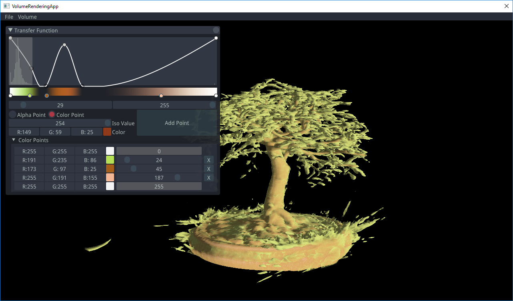
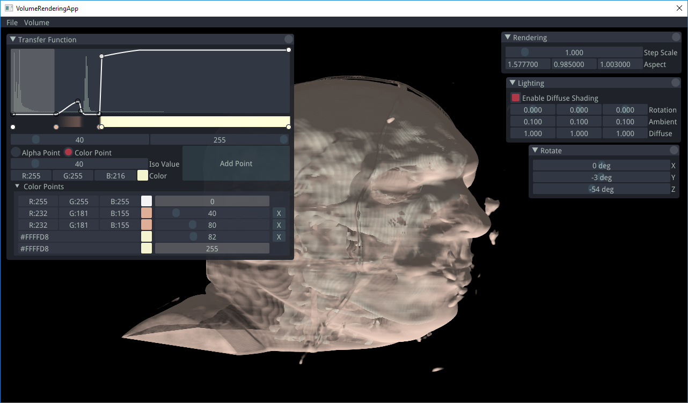
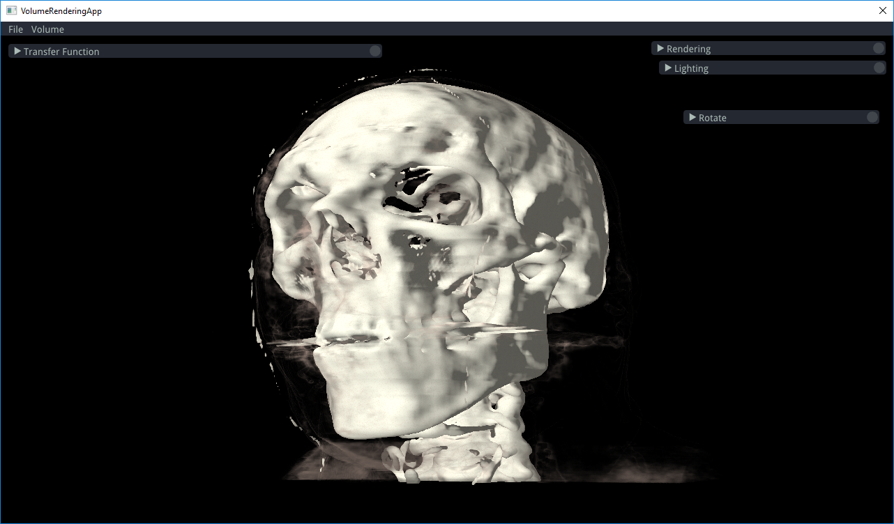

Volume Rendering using Raycasting

Made with **C++**, **OpenGL**, **Cinder**, **GLM** and **dear imgui**.

Loads 8 and 16 bit raw volumetric data. And displays this volume on screen using raycasting. Some features include ray jitter with random noise and voxel's solidity check to reduce banding / artifacts, fast computation of gradients, gradients smoothing with 3x3x3 average filter and histogram extraction using compute shaders.

*Requirements:*

**OpenGL 4.3+**

